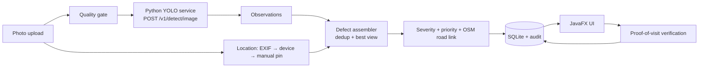

# RoadSense: image-only road defect decision engine

> Anyone can photograph a road defect; a Java decision engine locates it, counts it once,
> ranks what to fix first with an explainable score, and checks a later photo before
> calling it repaired.

**Status: Phase 0 scaffold. Nothing is implemented or measured yet.**
See `docs/PHASE_STATUS.md` for progress and `docs/RESULTS.md` for numbers
(every metric reads `NOT YET MEASURED` until a script writes it).

## Architecture in one picture



| Layer | Language | Job |
|---|---|---|
| Perception | Python (FastAPI + YOLO) | Boxes, classes, confidence. Stateless. |
| Decision engine | Java | EXIF/location, quality, dedup, severity, priority, OSM, lifecycle, persistence, privacy |
| Presentation | Java (JavaFX) | Upload, map, queue, gallery, verification, admin |
| Training/eval | Python | Offline only |

## Repository layout

```
ai-service/      Python perception service + training + evaluation
java-app/        Java 21 / Maven decision engine and JavaFX UI
docs/            Design, contracts, roadmap, prompts, ADRs, results
docs/prompts/    Phase-by-phase master + verification prompts (paste into Antigravity)
sample-data/     Tiny approved fixtures only (never real people/plates)
data/            Datasets (git-ignored, see docs/DATASETS.md)
scripts/         Repo-level helper scripts
.agents/rules/   Rules Antigravity loads automatically
```

## How we build (the loop)

1. Open `docs/prompts/phase-NN-*.md`. Check the recommended model.
2. Paste the **MASTER PROMPT** into a fresh Antigravity conversation (Planning mode). Approve the plan.
3. When done, run the **VERIFICATION PROMPT** in a *different* model family. It writes `docs/verification/phase-NN.md`.
4. Fix any FAIL items, then open a PR from `phase/NN-name` and tick `docs/PHASE_STATUS.md`.

## Data

Training data: RDD2022 (figshare DOI 10.6084/m9.figshare.21431547) and the
`sekilab/RoadDamageDetector` repository. Details, licence checks and citation in `docs/DATASETS.md`.

## Honesty rules

Proposals are labelled as proposals. Library names are candidates to verify. Reported
numbers come only from files produced by scripts in this repo. Staged or synthetic demo
data is always labelled. See `AGENTS.md`.
