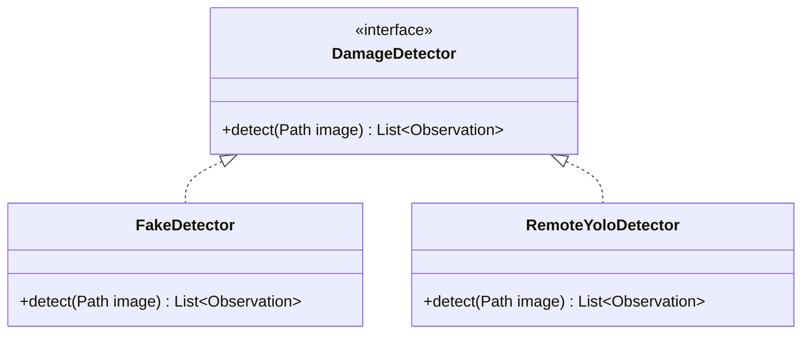

# UML and Architecture Diagrams

This repository standardizes on **Mermaid** for all architecture, class, state, and sequence diagrams (see [ADR 0003](file:///Users/haseena/Desktop/roadsense/docs/adr/0003-uml-tool.md)).

## Convention
1. **Tool**: Mermaid (`mermaid` code blocks in GitHub Flavored Markdown, or standalone `.mmd` files in this directory).
2. **Native Rendering**: Rendered directly in GitHub, IDE Markdown previews, and documentation viewers without external toolchains or Graphviz installations.
3. **Diagram Types**:
   - **Class Diagrams**: For OOP hierarchy, design patterns, and package mapping (`docs/OOP_DESIGN.md`).
   - **Sequence Diagrams**: For pipeline orchestration (`ReportPipeline`, `DamageDetector` calls).
   - **State Diagrams**: For defect lifecycle and verification state machines (system machine state vs. officer workflow state).
4. **Style Guidelines**:
   - Keep diagrams focused on specific subsystems rather than monolithic overviews.
   - Quote node labels containing spaces or punctuation.
   - Document extension points and design patterns explicitly.

## Example Class Diagram

