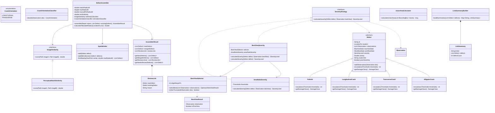

# Analysis Package Class Diagram

```mermaid
classDiagram
    class Defect {
        <<abstract>>
        -String id
        -LocationFix location
        -List~Observation~ observations
        -MachineState machineState
        -WorkflowState workflowState
        -SeverityLevel severity
        -Double priority
        -String roadLinkId
        -boolean poorViewOnly
        +addObservation(Observation obs)
        +escalation(Thresholds thresholds) int*
        +getDamageClass() DamageClass*
    }

    class Pothole {
        +escalation(Thresholds thresholds) int
        +getDamageClass() DamageClass
    }

    class LongitudinalCrack {
        +escalation(Thresholds thresholds) int
        +getDamageClass() DamageClass
    }

    class TransverseCrack {
        +escalation(Thresholds thresholds) int
        +getDamageClass() DamageClass
    }

    class AlligatorCrack {
        +escalation(Thresholds thresholds) int
        +getDamageClass() DamageClass
    }

    Defect <|-- Pothole
    Defect <|-- LongitudinalCrack
    Defect <|-- TransverseCrack
    Defect <|-- AlligatorCrack

    class CrackOrientation {
        <<enumeration>>
        LONGITUDINAL
        TRANSVERSE
    }

    class CrackOrientationClassifier {
        +decide(Observation obs) CrackOrientation
    }

    class ImageSimilarity {
        <<interface>>
        +score(Path imageA, Path imageB) double
    }

    class PerceptualHashSimilarity {
        +score(Path imageA, Path imageB) double
    }

    ImageSimilarity <|.. PerceptualHashSimilarity

    class DefectAssembler {
        -double matchRadiusM
        -double maxRadiusM
        -double manualPinRadiusM
        -double minSimilarity
        -ImageSimilarity similarityCalculator
        -CrackOrientationClassifier orientationClassifier
        +assemble(Report report, List~Defect~ existingDefects) AssemblerResult
        +calculateAllowableRadius(LocationFix loc) double
    }

    class AssemblerResult {
        -List~Defect~ newDefects
        -List~Defect~ mergedDefects
        -List~ReviewLink~ reviewLinks
        +getNewDefects() List~Defect~
        +getMergedDefects() List~Defect~
        +getReviewLinks() List~ReviewLink~
        +getNeedsReviewDefects() List~Defect~
    }

    class ReviewLink {
        -Defect newDefect
        -Defect existingDefect
        -String reason
    }

    class SpatialIndex {
        +add(Defect defect)
        +addAll(Collection~Defect~ defects)
        +findNearby(GeoPoint center, double maxRadiusM) List~Defect~
    }

    class BestViewResult {
        -Observation observation
        -boolean isPoorView
    }

    class BestViewSelector {
        -int edgeMarginPx
        +selectBest(List~Observation~ observations) Optional~BestViewResult~
        +isNonTruncated(Observation obs) boolean
    }

    class SeverityStrategy {
        <<interface>>
        +calculateSeverity(Defect defect, Observation bestView) SeverityLevel
    }

    class AreaRatioSeverity {
        -Thresholds thresholds
        +calculateSeverity(Defect defect, Observation bestView) SeverityLevel
    }

    class BestViewSeverity {
        -BestViewSelector selector
        -AreaRatioSeverity areaRatioSeverity
        +calculateSeverity(Defect defect, Observation bestView) SeverityLevel
        +calculateSeverity(Defect defect) SeverityLevel
    }

    SeverityStrategy <|.. AreaRatioSeverity
    SeverityStrategy <|.. BestViewSeverity

    class UnionAreaCalculator {
        +calculateUnionArea(List~BoundingBox~ boxes) long
    }

    class LinkSummary {
        -String linkId
        -List~Defect~ defects
        -int defectCount
    }

    class LinkSummaryBuilder {
        +buildSummaries(List~Defect~ defects) Map~String, LinkSummary~
    }

    DefectAssembler --> ImageSimilarity
    DefectAssembler --> SpatialIndex
    DefectAssembler --> AssemblerResult
    AssemblerResult *-- ReviewLink
    BestViewSelector ..> BestViewResult
    BestViewSeverity --> BestViewSelector
    BestViewSeverity --> AreaRatioSeverity
    SeverityStrategy ..> Defect
    SeverityStrategy ..> Observation
    LinkSummaryBuilder *-- LinkSummary
```
